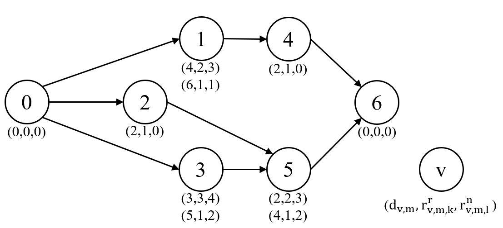
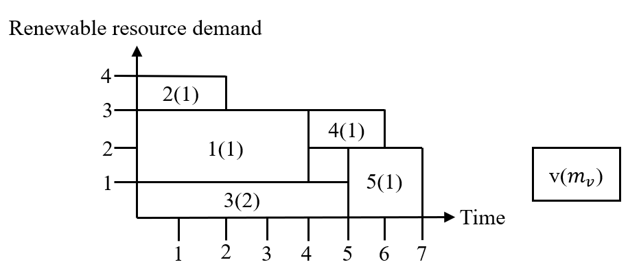
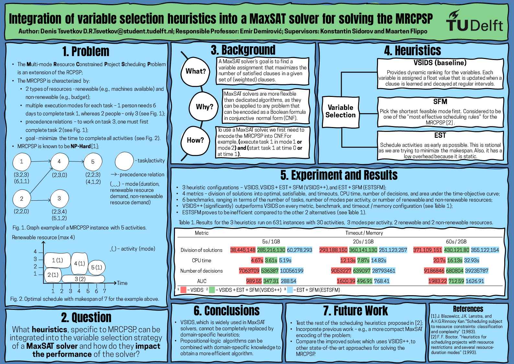

# Project
This project contains the code used for my bachelor thesis as part of the 2023 Q4 [Research Project](https://github.com/TU-Delft-CSE/Research-Project) of [TU Delft](https://github.com/TU-Delft-CSE).

**Note:** The MaxSAT solver used during my research is provided by the Faculty of Electrical Engineering, Mathematics, and Computer Science. As it is still under development, it is not yet made public. Therefore, to reproduce the experiments, please refer to the *implementation details*, mentioned in Section 4.2 of [my thesis](https://repository.tudelft.nl/islandora/object/uuid:0c85f1d6-5471-42e7-9794-091ff7b40c40?collection=education).

# MRCPSP
The **m**ulti-mode **r**esource-**c**onstrained **p**roject **s**cheduling **p**roblem (MRCPSP) is a generalization of the RCPSP. It allows activities to be executed in multiple modes while using 2 types of resources, renewable and non-renewable. Renewable resource are limited at deterministic points in time, e.g., number of machines / people available. In contrast, non-renewable resource are limited for the whole makespan. Each mode can have a distinct processing time and / or resource requirements. Furthemore, the activities in the MRPCSP are subject to precedence relations. Finally, the goal of the MRCPSP in most cases is to minimize the makespan (the time it takes to complete all activities).

The MRCPSP can also be modelled as directed acyclic graph (DAG). An example of an MRCPSP instance with 5 non-dummy activities, 1 renewable and 1 non-renewable resource is shown in the figure below. Each node represents an activity, each edge - a precedence relation, and each label under a node - a correspoding mode for that activity, defined as a triplet of the mode's processing time, and its demand for renewable and non-renewable resources.

The optimal schedule for the example is shown in the figure below. Each square represents an activity and the selected mode. Note that the capacity for the renewable resource is 4 and for the non-renewable - 8.

# Poster

